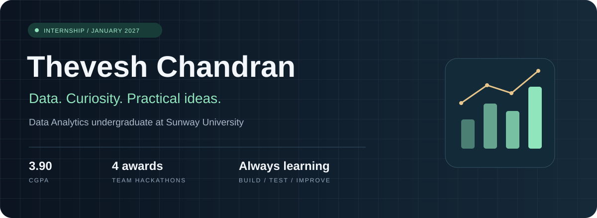

  
  

<a href="#about-me">About</a> · <a href="#selected-work">Selected work</a> · <a href="#built-with-a-team">Team projects</a> · <a href="#my-toolkit">Toolkit</a> · <a href="#lets-connect">Contact</a>

## About me

Hi, I'm Thevesh. I'm a third-year **Bachelor of Information Systems (Honours) (Data Analytics)** student at **Sunway University**, with a **3.92 CGPA**.

I like finding the story in data and turning it into something useful. My work includes analysing millions of flight records and comparing database performance. I'm currently developing a weather-aware analytics capstone for pest-control operations.

Through coursework, I've developed skills in data cleaning, exploratory analysis, visualisation, predictive modelling and model evaluation. Outside the technical work, teaching, administration and student representation have helped me learn to listen and explain ideas clearly.

**Looking for an internship from January 2027** in data analytics, data science, data engineering or business analysis.

## Selected work

<table>
<tr>
<td width="50%" valign="top">
<h3>01 / US Flight Delay Analysis</h3>

Exploring arrival delays across <strong>7.08 million flight records</strong>. Compared PySpark on EMR with Pandas on EC2 and verified matching analytical outputs.

<code>Python</code> <code>PySpark</code> <code>AWS</code>

<a href="https://github.com/Thevesh-Chandran/ist3134-flight-delay-analysis">Explore the analysis →</a>
</td>
<td width="50%" valign="top">
<h3>02 / Nomobug Analytics</h3>

An ongoing capstone bringing operational and weather data together for pest-control decisions. Currently focused on source integration and pipeline development.

<code>Data engineering</code> <code>Python</code> <code>SQL</code>

<a href="https://github.com/Thevesh-Chandran/Capstone-Project-x-Nomobug">Follow the project →</a>
</td>
</tr>
<tr>
<td colspan="2" valign="top">
<h3>03 / MongoDB vs CockroachDB</h3>

A database study using 100,000 sales records to investigate performance, scaling and transaction behaviour.

<code>MongoDB</code> <code>CockroachDB</code> <code>Python</code>

<a href="https://github.com/Thevesh-Chandran/Database-Management-Systems-Final-Report">Explore the experiments →</a>
</td>
</tr>
</table>

## Built with a team

Projects I built with hackathon teammates. UniGuide and the Service Desk Command Center are hosted in a teammate's repositories, where I'm a collaborator.

| Project | What we built | Team achievement |
|---|---|---|
| [**UniGuide**](https://github.com/ZenBen5173/uniguide) | An AI workflow assistant that helps students navigate university procedures with source-backed guidance. | **2nd Runner-Up**, UMHackathon 2026 |
| [**Service Desk Command Center**](https://github.com/ZenBen5173/service-desk-command-center) | A command centre for recurring support issues, risk visibility and human review, with agents running on Supervity Auto. | **3rd Place, Customer Support Track**, AutoPilot Asia 2026 |
| [**Swytch**](https://github.com/Thevesh-Chandran/Breaking-Bad-payhack) | A Flutter prototype exploring payment modes, transfers and rewards through demonstration interfaces. | **Semifinalist**, Pay Hack |

I also won **1st Place at AI VideoHackathon KL 2026** with **Team Git Outta Here**, creating an AI short film centred on Malaysia's National Monument. That experience taught me how much a good story matters—even when the tools don't quite cooperate.

### Lumie World

[**Lumie World**](https://github.com/Thevesh-Chandran/Lumie-World) is a language-learning prototype with character conversations, personalised learning, rewards and speech playback.

`Python` · `Streamlit` · `AWS`

## My toolkit

| Area | Tools |
|---|---|
| Programming & analysis |  &nbsp;  &nbsp;  &nbsp;  &nbsp;  &nbsp;  |
| Visualisation |  &nbsp;  |
| Machine learning |  |
| Data platforms |  &nbsp;  &nbsp;  |
| Development |  &nbsp;  &nbsp;  &nbsp;  |

## Let's connect

I'm interested in opportunities where I can work with real data, contribute to a team and keep developing my skills.

**[Connect with me on LinkedIn →](https://www.linkedin.com/in/theveshchandran/)**

Learning through coursework. Building through curiosity. Improving through practice.

